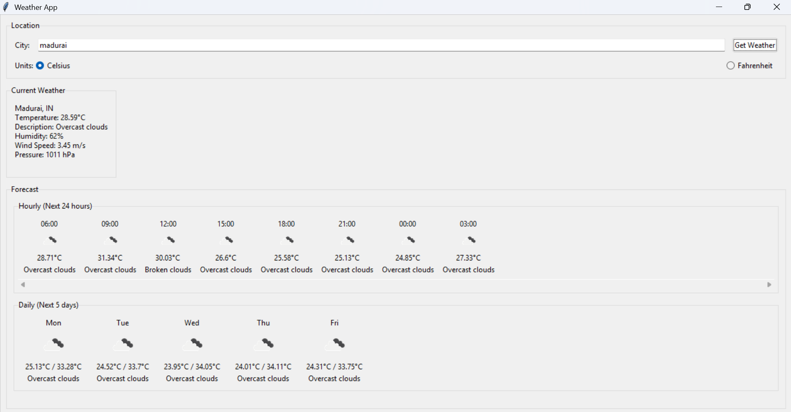

# ⛅ Weather App (Tkinter)  
**OIBSIP Python Programming Task 4**  

A simple **Weather Application** built with **Python (Tkinter)** that fetches real-time weather data using an API.  
This app allows users to enter a city name and view live weather conditions like temperature, humidity, wind speed, and weather description.  

---

## ✨ Features
- 🌍 Fetch real-time weather data of any city  
- 🌡️ Display temperature, humidity, and wind speed  
- 🔎 Search weather by city name  
- 🖥️ User-friendly Tkinter GUI  
- 📋 Error handling for invalid inputs or failed API calls  

---

## 📸 Screenshot

Example:  


---

## 🖼️ Demo Video

[]()


## 🛠️ Installation & Usage

### 1. Clone the Repository
```bash
git clone https://github.com/VishnuKumarLH/OIBSIP_Python_Programming_Task4.git
cd OIBSIP_Python_Programming_Task4
```

### 2. Install Dependencies
Make sure you have Python installed. Install required packages:
```bash
pip install requests
```

### 3. Run the Application
```bash
python weather_app.py
```

---

## 📂 Project Structure
```
OIBSIP_Python_Programming_Task4/
│
├── weather_app.py      # Main Python script
├── README.md           # Project documentation
└── demo_img.png        # Demo screenshot / thumbnail
```

---

## 🚀 How It Works
1. Enter the **city name** in the input box.  
2. Click the **Get Weather** button.  
3. The app fetches data from the weather API.  
4. Results (temperature, humidity, wind, description) are shown in the GUI.  

---

## 📦 Requirements
- Python 3.x  
- `requests` library  
- `tkinter` (built-in with Python)  

---

## 📜 License
This project is **open-source** and available under the [MIT License](LICENSE).  

---
👨‍💻 Developed with ❤️ by **Vishnukumar**
